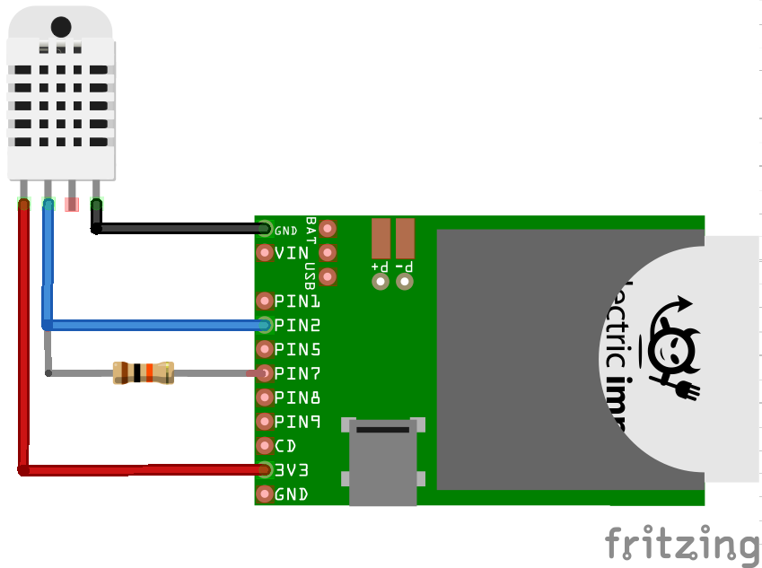

Driver for the DHT22 Temperature/Humidity Sensor
===================================

Author: [Tom Byrne](https://github.com/tombrew/)

Driver class for a [DHT22 temperature/humidity sensor](https://learn.adafruit.com/dht).

Datasheets for this part are quite numerous and varied; [this one was useful](https://www.sparkfun.com/datasheets/Sensors/Temperature/DHT22.pdf) in writing this class.

## Hardware Setup
The DHTxx family uses a proprietary 1-wire protocol. The imp can emulate this protocol with SPI, using both the MISO and MOSI lines. To use, tie MISO and MOSI together with a 1kΩ resistor, then tie MISO to the DATA line on the DHTxx.

