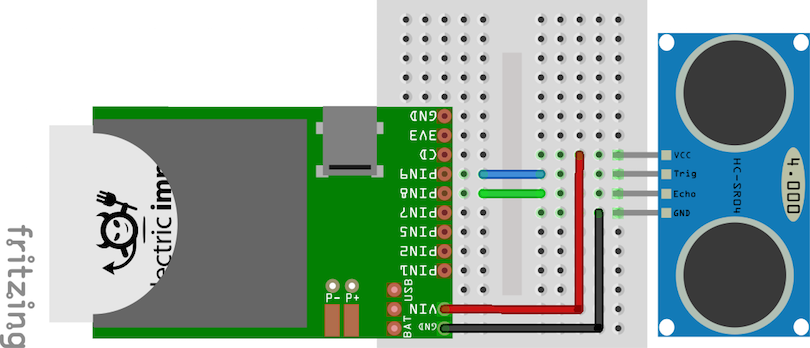

Driver for the HC-SR04 Ultrasonic Range Finder
===================================

Author: [Tom Byrne](https://github.com/ersatzavian/)

The [HC-SR04](https://docs.google.com/document/d/1Y-yZnNhMYy7rwhAgyL_pfa39RsB-x2qR4vP8saG73rE/edit) is an ultrasonic, non-contact range finder that can detect the distance to an obstacle from 2cm to 400 cm (1” to 13 feet).

This device uses two imp pins; one digital output (Trigger) and one digital input (Echo). The trigger pin is used to send a pulse, which causes the ultrasonic emitter to emit a tone. The echo line pulses when the tone is returned. The length of the echo pulse is proportional to the distance to the obstacle. 

## Hardware Setup

| HC-SR04 Pin | Connect To | Notes |
|-------------|------------|-------|
| VIN | 5V Supply | The imp is technically not 5V tolerant, but pins configured as Digital I/O can be used with 5V logic on some models. Not sure if you're safe? Use a [level translator!](https://www.sparkfun.com/products/12009) |
| Trig | Any Imp Pin (DIGITAL_OUT) | |
| Echo | Any Imp Pin (DIGITAL_IN) | |


## Usage
The constructor takes two required arguments: trigger pin and echo pin. Both pins must be configured appropriately before passing to the constructor.

The class has two methods: read_cm and read_in, to return the range to an obstacle in the desired units.

```
trig <- hardware.pin8;
echo <- hardware.pin9;

trig.configure(DIGITAL_OUT,0);
echo.configure(DIGITAL_IN);

range <- HCSR04(trig, echo);
server.log(range.read_in()+"\"");
server.log(range.read_cm()+" cm");
```
