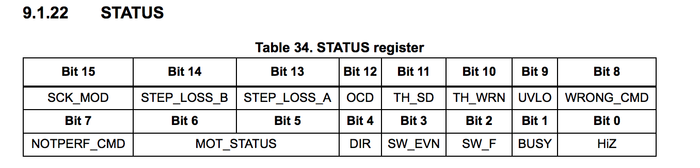

L6470 "dSPIN" Stepper Motor Driver
===================================

Author: [Tom Byrne](https://github.com/ersatzavian/)

Driver class for a [L6470 "dSPIN" Stepper Motor Driver IC with SPI interface](http://www.st.com/st-web-ui/static/active/en/resource/technical/document/datasheet/CD00255075.pdf
).

Sparkfun offered a [now-discontinued-but-available-on-ebay breakout](https://www.sparkfun.com/products/11611) for this IC, which makes getting started with an Imp and a stepper motor quite straightforward.

This class implements most of the L6470's feature list:

 *  Programmable home and mark positions.
 *  Programmable min and max speed.
 *  Microstepping up to 1/128 step.
 *  Goto commands which can specify a direction or omit a direction to take the shortest path.
 *  Programmable max applied motor voltages for accel, decel, run, and hold modes.

## Hardware Setup
The Sparkfun breakout includes more I/O than an Imp card has available, but use of the SYNC and BUSY pins is not required. These pins can easily be used with an Imp module, but are not implemented in this class. Either of the Imp's SPI interfaces can be used, and any Imp GPIO can be used for any L6470 GPIO. Here is an example configuration (which matches the code):

| Imp Pin | L6470 Breakout Pin | Description |
| ------- | ------------------ | ----------- |
| Pin1    | CK                 | SPI Clock   |
| Pin2    | CSN                | Chip Select, Active Low |
| Pin5    | STBY_L/RST_L       | L6470 Reset, Active Low |
| Pin7    | FLGN               | L6470 Flag Output, Active Low |
| Pin8    | SDI                | SPI MOSI. Data from Imp to L6470 |
| Pin9    | SDO                | SPI MISO. Data from L6470 to Imp |

## Instantiation

GPIO pins and the SPI interface must be configured before passing to the constructor. The STBY_L/RST_L and FLAG_L pins are optional.

```
const SPICLK_KHZ = 500; // kHz
const STEPS_PER_REV = 48; // using sparkfun's small stepper motor

spi <- hardware.spi189;
cs_l <- hardware.pin2;
rst_l <- hardware.pin5;
flag_l <- hardware.pin7;

spi.configure(CLOCK_IDLE_LOW | MSB_FIRST, SPICLK_KHZ);
cs_l.configure(DIGITAL_OUT);
rst_l.configure(DIGITAL_OUT);
flag_l.configure(DIGITAL_IN);

motor <- L6470(spi, cs_l, rst_l, flag_l);
```

## Usage

### Initial Motor Configuration

When the class is first instantiated, several properties need to be configured in order for the class methods to operate the motor properly: 

1. Set microstepping mode.
1. Configure oscillator source and PWM multiplier.
1. Read the Status Register to clear the Overcurrent bit.

Other items may also need to be configured or adjusted to produce smooth operation: 

1. Set max speed / full-stepping speed. 
1. Set maximum acceleration and deceleration speeds. 
1. Set K-Values.

#### Steps Per Motor Revolution

Stepper motors have varying number of poles, and therefore varying numbers of full steps per revolution. Many stepper motors are also geared, so that: 

(Electrical Steps per Shaft Revolution) = (Electrical Steps per Motor Revolution) * (Gear Ratio)

The L6470 is aware of the motor's electrical speed; to set speeds in terms of shaft revolutions/second, you'll need to be aware of the number of electrical steps per shaft revolution. For instance, once configured, to run a motor with 10 electrical steps per revolution at 1 rev/s in the forward direction: 

```
// run(fwd = 1, speed (steps/sec))
motor.run(1, 10);
```

#### Set Microstepping Mode

To finely position a stepper motor between integer-value electrical steps, the L6470 supports "microstepping"; a technique where multiple motor phases are enabled at different relative strengths at the same time to align the motor's poles with a position in between the motor's phases. 

Use `setStepMode(const)` to configure the microstepping mode. The L6470 supports up to 1/128th microstepping.

##### Parameters

| Constant | Description |
| -------- | ----------- |
| STEP_MODE_SYNC | Synchronous Mode; uses external Sync pin to control stepping. |
| STEP_SEL_FULL | Full-step mode. |
| STEP_SEL_HALF | Half-step mode. |
| STEP_SEL_1_4 | Quarter-step mode. |
| STEP_SEL_1_8 | 1/8 Step mode. |
| STEP_SEL_1_16 | 1/16 Step mode. |
| STEP_SEL_1_32 | 1/32 Step mode. |
| STEP_SEL_1_64 | 1/64 Step mode. |
| STEP_SEL_1_128 | 1/128 Step mode. |

##### Example

```
motor.setStepMode(STEP_SEL_1_64);
```

#### Program Config Regiser

The config register bitfield has been mapped with OR-able constants for convienience. The bitfield description is in section 9.1.21 of the L6470 datasheet.


#### Example: 

```
// configure L6470 to use internal 16 MHz oscillator, run PWM at 32 MHz.
motor.setConfig(CONFIG_INT_OSC | CONFIG_PWMMULT_2_000);
```

##### Set Oscillator Source

The L6470 can be clocked with either an internal 16 MHz RC oscillator, an external crystal or resonator at 8, 16, 24, or 32 MHz (using an internal crystal driver), or with an external 8, 16, 24 or 32 MHz oscillator (with the internal crystal driver disabled). 

Only the internal oscillator option is mapped to a constant. By default, when the L6470 powers up, the internal 16 MHz oscillator is used and a 2 MHz clock is supplied on the OSCOUT pin.

| Constant | Description |
| -------- | ----------- |
| CONFIG_INT_OSC | Use internal 16 MHz Oscillator. |

##### Set PWM Configuration 

Phases are PWMed to control the voltage applied to the motor phases at each mode of operation (a brushless DC motor is equivalent to a Buck regulator over periods of time much less than one electrical phase). The PWM frequency can be changed by setting an divisor and multiplier to determine the number of base clocks per PWM period. PWM Multiplier and Divisor values are ORable constants that can be supplied to the `setConfig` method.

| Constant | Description |
| -------- | ----------- |
| CONFIG_PWMDIV_1 | Divide Base Clock By 1. |
| CONFIG_PWMDIV_2 | Divide Base Clock By 2. |
| CONFIG_PWMDIV_3 | Divide Base Clock By 3. |
| CONFIG_PWMDIV_4 | Divide Base Clock By 4. |
| CONFIG_PWMDIV_5 | Divide Base Clock By 5. |
| CONFIG_PWMDIV_6 | Divide Base Clock By 6. |
| CONFIG_PWMDIV_7 | Divide Base Clock By 7. |
| CONFIG_PWMMULT_0_625 | Multiply Base Clock By 0.625. |
| CONFIG_PWMMULT_0_750 | Multiply Base Clock By 0.750. |
| CONFIG_PWMMULT_0_875 | Multiply Base Clock By 0.875. |
| CONFIG_PWMMULT_1_000 | Multiply Base Clock By 1. |
| CONFIG_PWMMULT_1_250 | Multiply Base Clock By 1.25. |
| CONFIG_PWMMULT_1_500 | Multiply Base Clock By 1.5. |
| CONFIG_PWMMULT_1_750 | Multiply Base Clock By 1.75. |
| CONFIG_PWMMULT_2_000 | Multiply Base Clock By 2. |

##### Other Config Register Parameters

The L6470 has a number of other features that can be controlled using consts supplied to the `setConfig` method. See datasheet section 9.1.21 for more details. 

| Constant | Description |
| -------- | ----------- |
| CONFIG_OC_SD | Shut down driver bridges if overcurrent event occurs. |
| CONFIG_SR_75 | Slew-rate limit driver bridges to 75 V/µs. |
| CONFIG_SR_110 | Slew-rate limit driver bridges to 110 V/µs. |
| CONFIG_SR_260 | Slew-rate limit driver bridges to 260 V/µs. |
| CONFIG_SR_320 | Slew-rate limit driver bridges to 320 V/µs. |
| CONFIG_VSCOMP | Enable supply voltage compensation (see section 7.5) |
| CONFIG_SW_USER | Use external switch for user functions, instead of generating a HARDSTOP interrupt (See section 6.13) |
| CONFIG_EXT_CLK | Supply clock on OSCOUT Pin. |

### Applied Voltage Coefficients

When a brushless DC motor is not turning, voltage applied across a phase produces current through the phase based only on the DC resistance of the phase winding: 

I(phase) = V(applied) / R(winding)

Once the motor starts turning, magnets pass over phase windings. Changing magnetic flux over a coil induces a current in that coil (Thanks, Faraday!) If current is flowing, a voltage is present. Thus, as a motor turns, a Back-EMF is developed in the motor that opposes current that's driving the motor. Back-EMF is proportional to the speed of the motor, and depends on the winding of the motor. Your motor datasheet (if you have one) should give you a value for KV, the motor velocity constant, probably in rpm/V. This tells you how fast the motor will turn when supplied at a given voltage, ideally, when unloaded. In this state, the back-EMF developed is equal to the applied voltage.

Also of note: the motor's K-constant tells you the relationship between applied current and torque, 

KT = 𝞃/IA = 60 / (2π * KV)

Anyway, when the motor is turning, the current through the phase is: 

I(phase) = [ V(applied) - V(back-emf) ] / R(winding).

During operation, the L6470 does two basic things: 

1. Tracks the position of the motor poles and switches the phases appropriately as the motor turns.
1. During each phase, switches the phases on and off rapidly to regulate the voltage applied to the motor phases. 

A very cool feature of the L6470 is that it allows you to control the maximum V(applied) for each state of operation (running, accelerating, or holding position). This lets you control the speed even when you're operating below the value in the max speed register, as well as manage the power dissipation and therefore heat generated inside the motor for each phase of operation. 

See the sections below on `setHoldKval`, `setRunKval`, and `setAccKval` to see how these commands work. 

### Full Command List

#### reset( )
Uses the reset line to hard-reset the L6470, if available. If a reset line was not provided to the constructor, this command will send a SoftReset command via SPI instead.

The L6470 comes out of reset with the Overcurrent bit set in the status register. Read the status register with `getStatus()` to clear the bit and operate the L6470.

```
motor.reset();
```

#### softReset( )
Sends a soft reset command via SPI. 

The L6470 comes out of reset with the Overcurrent bit set in the status register. Read the status register with `getStatus()` to clear the bit and operate the L6470.

```
motor.softReset();
```

#### getStatus( )
Reads the L6470 status register. Returns the 2-byte value as an integer. See datasheet section 9.1.22 for full description.



```
server.log(format("Status Register: 0x%04x", motor.getStatus()));
```

#### isBusy( )
Reads the Status register and checks the state of the BUSY bit. Returns 1 if bit is set, 0 otherwise: 

```
if (motor.isBusy()) {
	server.log("L6470 Busy!");
}
```

#### setConfig( val )
Sets the contents of the L6470 configuration register. This is typically done by ORing together the provided constants to set up the controller, but a raw 2-byte value can also be supplied. 

Returns nothing. 

```
motor.setConfig(CONFIG_INT_OSC | CONFIG_PWMMULT_2_000);
```

#### getConfig()
Reads the L6470 config register. Returns the 2-byte value as an integer. See datasheet section 9.1.21 for full description.


```
server.log(format("Config Register: 0x%04x", motor.getConfig()));
```

#### setStepMode( mode )
Configures the L6470 stepping mode for synchrnous (external) control, full stepping, or microstepping. Values are mapped to constants; see "Set Microstepping Mode" above.

```
motor.setStepMode(STEP_SEL_1_64);
```

#### getStepMode( )
Reads the current microstepping mode and returns the divisor as an integer (or 0 for synchronous mode). Returns -1 on error. 

| Return Value | Mode |
| ------------ | ---- |
| 0 | Synchronous | 
| 1 | Full Step |
| 2 | 1/2 Step |
| 4 | 1/4 Step |
| 8 | 1/8 Step |
| 16 | 1/16 Step |
| 32 | 1/32 Step |
| 64 | 1/64 Step |
| 128 | 1/128 Step |

```
server.log(format("Current Step Mode: %d", motor.getStepMode()));
```

#### setMinSpeed( steps_per_second )
Sets the minimum motor speed in steps per second (integer). This will generate different angular rates depending on the number of steps per rotation in your motor. 

L6470 comes out of reset with min speed set to zero.

```
motor.setMinSpeed(10); // 10 steps per second. For my 10-step-per-rev motor, this is 1 rev/second
```

#### getMinSpeed( )
Reads the current minimum speed in steps per second (integer);

```
server.log(format("Current Min Speed in Steps/Second: %d", motor.getMinSpeed()));
```

#### setMaxSpeed( steps_per_second )
Sets the maximum motor speed in steps per second (integer). This will generate different angular rates depending on the number of steps per rotation in your motor. 

```
motor.setMinSpeed(100); // 100 steps per second. For my 10-step-per-rev motor, this is 10 rev/second
```

#### getMaxSpeed()
Reads the current maximum speed in steps per second (integer);

```
server.log(format("Current Max Speed in Steps/Second: %d", motor.getMaxSpeed()));
```

#### setFSSpeed( steps_per_second )
Sets the speed used when operating in full-stepping mode in steps per second (integer). 

```
motor.setFSSpeed(100); // 100 steps per second. For my 10-step-per-rev motor, this is 10 rev/second
```

#### getFSSpeed( )
Reads the current full-stepping speed in steps per second (integer).

```
server.log(format("Current Full-Stepping Speed in Steps/Second: %d", motor.getFSSpeed()));
```

#### setAcc( steps_per_second_per_second )
Sets the maximum motor acceleration (and deceleration) in steps per second, per second. Maximum is 4095 (0xFFF);

```
motor.setAcc(4095); // set max motor acceleration to highest possible value
```

#### setOCTh( th_milliamps )
Set motor phase overcurrent threshold in Milliamps. An overcurrent event will disable the bridges if the config register's overcurrent shutdown bit has been set with `CONFIG_OC_SD`. 

```
motor.setOcTh(6000); // set threshold to 6 A
```

#### setHoldKval( kval_hold )
Sets the K-value (float) for hold mode, which sets the maximum voltage applied to the motor as a function of the supply voltage. The K-val is effectively a supply voltage multiplier between 0 and 1: 

Vapplied, max = Vsupply * kval_hold. 

```
// in this example, my supply voltage is 10V
// set max applied voltage in hold mode to 1V.
motor.setHoldKval(0.1);
```

#### getHoldKval( )
Reads the current hold-state K-value and returns it as a float: 

```
server.log(format("Hold K-Value: %0.1f", motor.getHoldKval()));
```

#### setRunKval( kval_run )
Sets the K-value (float) for run mode, which sets the maximum voltage applied to the motor as a function of the supply voltage. The K-val is effectively a supply voltage multiplier between 0 and 1: 

Vapplied, max = Vsupply * kval_run. 

```
// in this example, my supply voltage is 10V
// set max applied voltage in hold mode to 5V.
motor.setRunKval(0.5);
```

#### getRunKval( )
Reads the current run-state K-value and returns it as a float: 

```
server.log(format("Run K-Value: %0.1f", motor.getRunKval()));
```

#### setAccKval( kval_acc )
Sets the K-value (float) for accelation mode, which sets the maximum voltage applied to the motor as a function of the supply voltage. The K-val is effectively a supply voltage multiplier between 0 and 1: 

Vapplied, max = Vsupply * kval_acc. 

```
// in this example, my supply voltage is 10V
// set max applied voltage During Acceleration to 5V.
motor.setAccKval(0.5);
``` 

#### getAccKval( )
Reads the current Accelerate-state K-value and returns it as a float: 

```
server.log(format("Acceleration K-Value: %0.1f", motor.getAccKval()));
```

#### setDecKval( kval_dec )
Sets the K-value (float) for deceleration mode, which sets the maximum voltage applied to the motor as a function of the supply voltage. The K-val is effectively a supply voltage multiplier between 0 and 1: 

Vapplied, max = Vsupply * kval_dec. 

```
// in this example, my supply voltage is 10V
// set max applied voltage During Deceleration to 5V.
motor.setDecKval(0.5);
``` 

#### getDecKval()
Reads the current Decelerate-state K-value and returns it as a float: 

```
server.log(format("Deceleration K-Value: %0.1f", motor.getDecKval()));
```

#### setLspdPosOpt( state )
During low-speed operation, phase crossovers can cause some motor position error. The L6470 includes a feature that attempts to minimize this distortion. This function enables or disables this feature. Provide 1 to enable, 0 to disable. 

```
motor.setLspdPosOpt(1);
```

#### getLspdPosOpt( )
Reads the state of the low-speed postion optimization feature. Returns 1 if feature is enabled, zero otherwise. 

```
if (motor.getLspdPosOpt()) {
	server.log("Low Speed Position Optimization Enabled.");
}
```

#### setAbsPos( pos_counts )
The 22-bit ABS_POS register contains the current motor absolute position in agreement with the selected step mode; the stored value unit is equal to the selected step mode (full, half, quarter, etc.). The value is in 2's complement format and it ranges from -2^21 to +(2^21)-1. 

This command sets the contents of the ABS_POS register. The supplied argument is the raw value to be stored in the register.

At power-on the register is initialized to “0” (HOME position).

Any attempt to write the register when the motor is running causes the command to be ignored and the NOTPERF_CMD flag to rise.

#### getAbsPos()
Reads the contents of the 22-bit absolute position count register and returns it as an integer. 

#### setElPos( el_pos_counts )
Sets the motor's current electrical position. The motor will move immediately to this position. Electrical position is a 9-bit value: 

* Bits 8 and 7 indicate the current step. 
* bits 6:0 indicate the current microstep. 

See datasheet section 9.1.2 for more details. 

#### getElPos( )
Returns the 9-bit value in the electrical position register. See datasheet section 9.1.2 for more details. 

#### setMark( mark_counts )
Set the absolute position mark register. Mark is a 22-bit value. Units match the current step unit (full, half, quarter, etc.). The value is in 2's complement format and values range from -2^21 to (2^21) - 1 in microsteps. 

The supplied argument is the raw value to be stored in the register.

See datasheet section 9.1.3 for more details. 

#### getMark( )
Reads the contents of the 22-bit absolute position mark register. See datasheet section 9.1.3 for more details. 

#### hardHiZ( )
The HardHiZ command immediately disables the power bridges (high impedance state) and raises the HiZ flag. When the motor is stopped, a HardHiZ command forces the bridges to enter into high impedance state.

This command can be given anytime and is immediately executed. This command keeps
the BUSY flag low until the motor is stopped.

#### softHiZ( )
The SoftHiZ command disables the power bridges (high impedance state) after a deceleration to zero; the deceleration value used is the one stored in the DEC register (see datasheet Section 9.1.6). 

When bridges are disabled, the HiZ flag is raised.

When the motor is stopped, a SoftHiZ command forces the bridges to enter into high impedance state. This command can be given anytime and is immediately executed. This command keeps the BUSY flag low until the motor is stopped.

#### goHome( )
The GoHome command produces a motion to the HOME position (zero position) via the
shortest path. Note that this command is equivalent to the “GoTo(0…0)” command. If a motor direction is mandatory, use the `GoTo` command instead. 

The GoHome command keeps the BUSY flag low until the home position is reached. This
command can be given only when the previous motion command has been completed. Any
attempt to perform a GoHome command when a previous command is under execution (BUSY low) causes the command to be ignored and the NOTPERF_CMD to rise (see datasheet Section 9.1.22).

#### goMark() 
The GoMark command produces a motion to the MARK position performing the minimum
path. Note that this command is equivalent to the “GoTo (MARK)” command. If a motor direction, use the `GoTo` command instead. 

The GoMark command keeps the BUSY flag low until the MARK position is reached. This
command can be given only when the previous motion command has been completed (BUSY flag released). Any attempt to perform a GoMark command when a previous command is under execution (BUSY low) causes the command to be ignored and the NOTPERF_CMD flag to rise (see datasheet Section 9.1.22).

#### move( dir, numsteps )
Move the motor num_steps in a direction. 

If dir = 1, the motor will move forward. If dir = 0, the motor will move in reverse.

The `numsteps` argument is a 22-bit value specifying the number of steps; units match the current step mode. 

```
motor.setStepMode(STEP_SEL_1_64);
// move 1 full step in reverse
motor.move(0, 64);
```

#### goTo( pos_counts, [dir] )
Move the motor directly to the specified position. Position is in steps and may be floating-point. The driver class will convert this to a 22-bit value in the same units as the current stepping mode. 

Direction is an optional argument. Provide 1 for forward, or 0 for reverse. If direction is not supplied, the motor will take the shortest route.

```
// run directly to the value marked in the MARK register
motor.goTo(motor.getMark());

// Note that you could do the same thing with: 
motor.goMark();
```

#### goUntil( [direction], [speed], [set_mark_reg] )
Move the motor until the L6470's SW line is pulled low. 

This function automates setting the home position with a limit switch or a hall sensor. 

If the SW_MODE bit in the config register is '0', the motor will hard-stop. If the SW_MODE bit is '1', the motor will decelerate smoothly.

Direction is optional and defaults to 1 (forward). Set to 0 to run in reverse. 

Speed is optional and defaults to the current maximum speed. 

The set_mark_reg parameter is optional and defaults to false. If set to true, the ABS_POS register will be preserved and copied to the MARK register when the SW line goes low. If left false, the ABS_POS register will be set to zero with the SW line goes low.

```
server.log("Attempting to find home position");
motor.goUntil(1, STEPS_PER_REV); // fwd, max 1 second to home. 
```

#### run( [direction], [speed] )
Run the motor. 

Direction is optional and is 1 for forward, 0 for reverse. If omitted, motor will run forward. 

Speed is an integer in steps per second. If omitted, motor will run at the current maximum speed.

```
// run the motor forward at 1 rev/sec for 2.5 seconds
// motor.run(1, STEPS_PER_REV);
```

#### stop( )
Soft-stop the motor. This will decelerate the motor smoothly to zero speed.