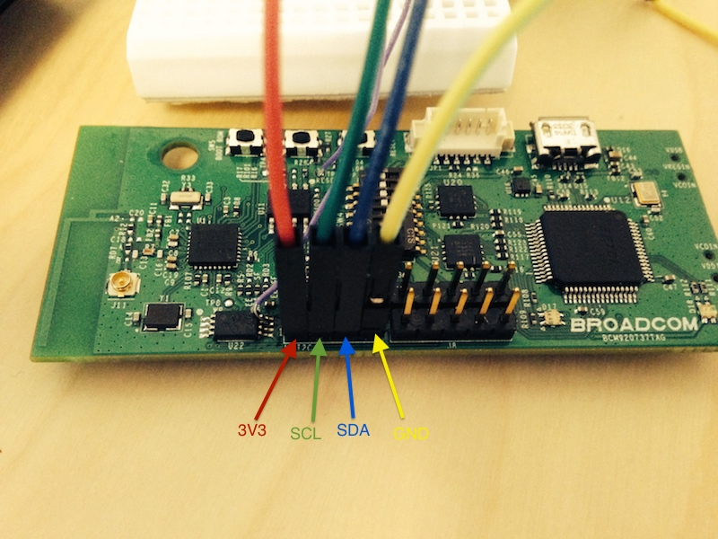
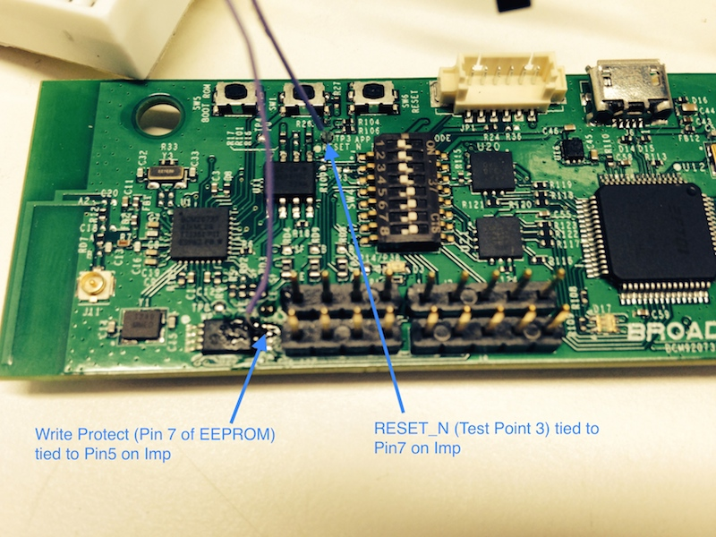

# BCM20737 Programmer Example

This example code shows how to program new application images built for the BCM20737 onto the device via the imp. 

## Setup

(assuming the BCM92073X Kit):

| Imp Breakout Pin | BCM9207X Pin/Net | Purpose | 
|------------------|------------------|---------|
| Pin5 | EEPROM Write Protect | Enable EEPROM write |
| Pin7 | Reset (active low) | BCM20737 Reset |
| Pin8 | I2C SCL |  |
| Pin9 | I2C SDA |  |
| 3V3 | 3V3 | Power |
| GND | GND | Ground |





## Use

The agent interface accepts commands as path variables:

- <agent_url>/dump: dump the current contents of the BCM20737 NV Memory to Agent Memory. 
- <agent_url>/dl: Returns a blob containing the current contents of the agent's copy of BCM20737 NV Memory. If the BCM20737's NV memory was previously dumped using the dump command, this command will return those contents.
- <agent_url>/program: accepts a POST request; the body of the request is treated as an application (Dynamic Section) image and programmed into BCM20737 NV Memory. The BCM20737 is then reset, causing it to run the application code

### Examples

Programming an image via CURL:

```
13:28:28-tom$ curl --data-binary @pwm.bin https://agent.electricimp.com/h3rpd3rp/program
OK
```

Dumping and downloading the current NV Memory contents:

```
13:16:27-tom$ curl https://agent.electricimp.com/h3rpd3rp/dump
Dumping EEPROM

13:17:09-tom$ curl https://agent.electricimp.com/h3rpd3rp/dl > img.bin
  % Total    % Received % Xferd  Average Speed   Time    Time     Time  Current
                                 Dload  Upload   Total   Spent    Left  Speed
100 65536  100 65536    0     0   249k      0 --:--:-- --:--:-- --:--:--  249k
```
