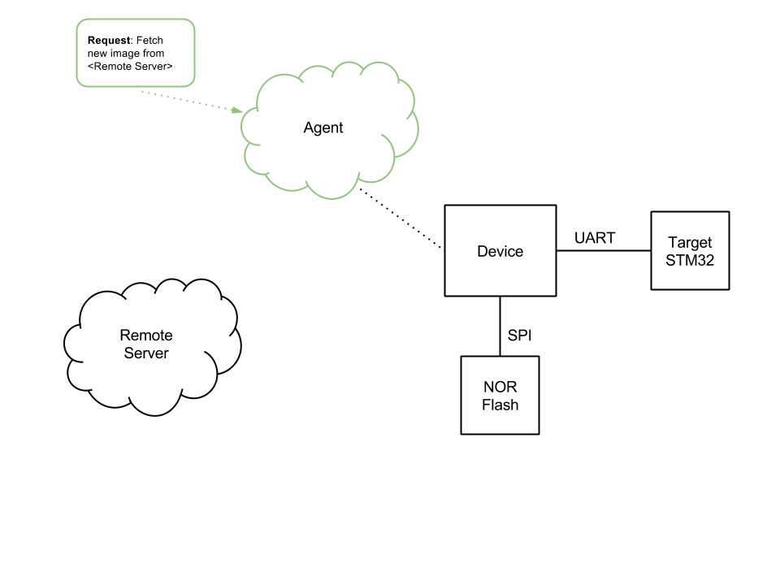
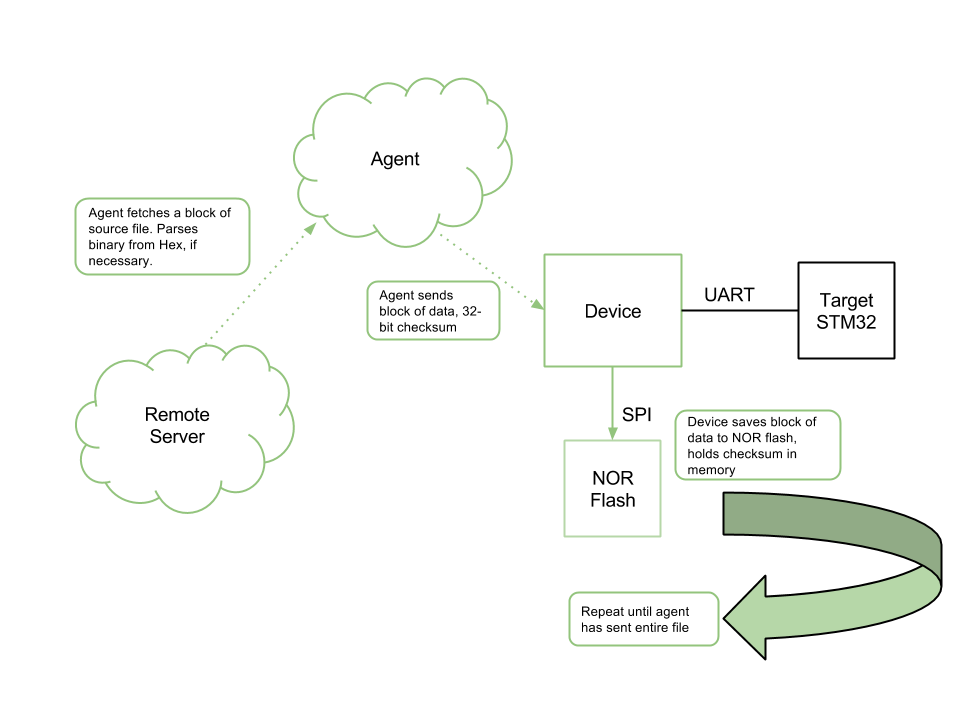
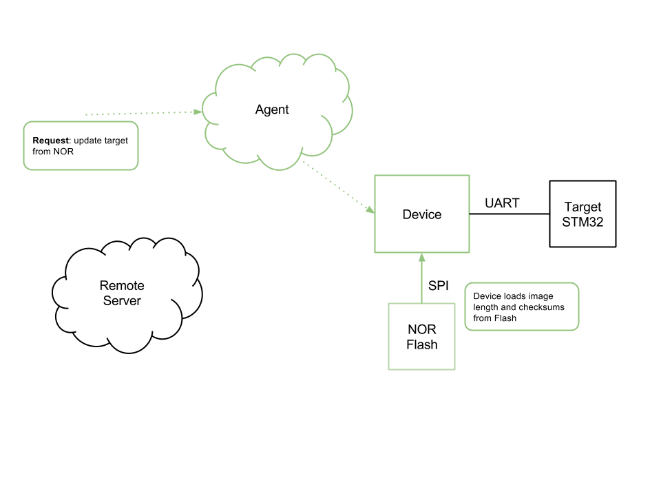
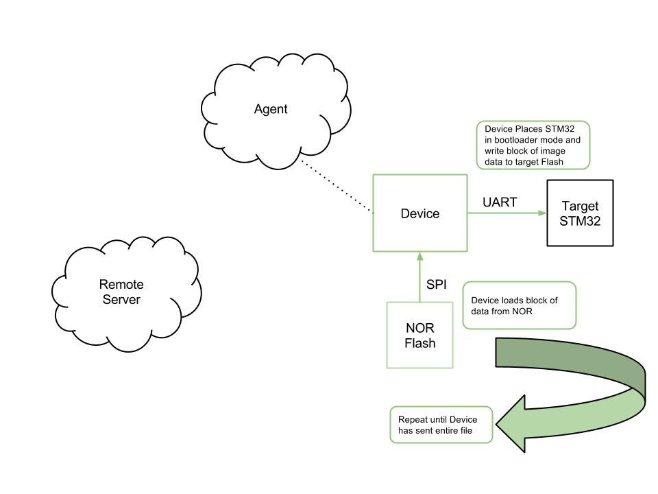
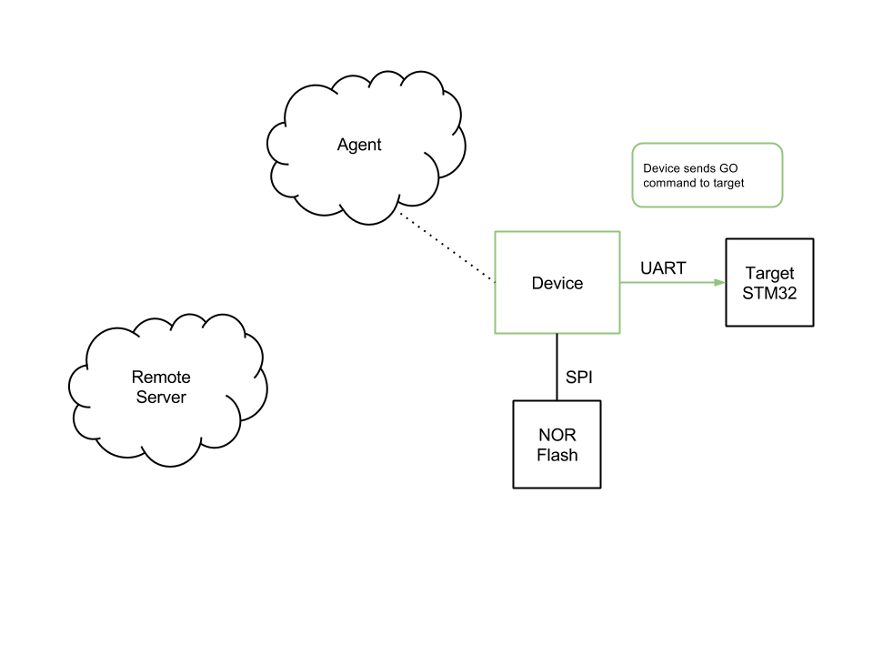

Using the STM32 Bootloader with External NOR Flash for Image Storage
==============================
In this example, the Electric Imp is connected to an external STM32 processor over UART, and a NOR flash IC over SPI. Images are downloaded to NOR flash when they arrive at the agent. A second request must be sent to the agent to then load the image from NOR flash into the STM32. 

SPI Flash is abstracted through the [SPI Flash driver class](https://github.com/electricimp/reference/tree/master/hardware/SpiFlash).

## Operation

<p align="center"><br><i>Step 1: Agent is instructed via an HTTP request to fetch an image from an external server</i><br>&nbsp;</p>

<p align="center"><br><i>Step 2: Agent downloads the new image file block-by-block, parses as necessary, and sends the binary image to the device. Each block comes with a 32-bit checksum, calculated by the agent, to protect the image when it is stored in flash. The device saves each block to flash, leaving the first sector of NOR for the checksums.</i><br>&nbsp;</p>

<p align="center"><br><i>Step 3: Device serializes and saves information about the image file, including the checksums</i><br>&nbsp;</p>

<p align="center"><br><i>Step 4: Agent is instructed via an HTTP request to initiate the target update process from NOR flash. Device loads the checksums and length into memory before beginning the image transfer.</i><br>&nbsp;</p>

<p align="center"><br><i>Step 5: Device transfers the image to the target flash block-by-block, verifying the checksum for each block before writing it to the target. Device sends "GO" command (or resets target) to start execution when full image is loaded.</i><br>&nbsp;</p>

## Hardware

To use this class, you'll need to connect one of the Imp's UARTs to one of the STM32's bootloader-compatible USARTs. Note that not all of the STM32's USARTs are available for use by the bootloader. 

You'll also need to connect any two Imp pins to BOOT0 and NRST on the STM32. If BOOT1 on the STM32 is not strapped to the correct value to allow the device to enter bootloader mode, you'll need to connect that to any Imp pin as well, and provide it to the Stm32 constructor.

If you're using the STM32F4-Discovery board, you can connect it up with an Amber board as I did:

| Amber Pin | STM32 Discovery Board Pin | Description |
| --------- | ------------------------- | ----------- |
| VIN | 5V | Power for Amber / Imp |
| GND | GND | Ground |
| Pin5 | PB11 | Imp TX / STM32 RX (USART3) |
| Pin7 | PB10 | Imp RX / STM32 TX (USART3) |
| Pin8 | NRST | STM32 Reset, Active-Low |
| Pin9 | BOOT0 | STM32 BOOT0 |

Note: 
- You cannot use STM32 USART1 on the STM32F4 Discovery board because the required pins are already in use on the discovery board
- You cannot use STM32 USART2 on the STM32F4 Discovery board because the STM32F4 does not support USART bootloader on USART2

You will also need to connect the Imp to a SPI Flash IC:

| SPI Flash Pin| Amber Pin | Description |
| --------- | ------------------------- | ----------- |
| CS_L | PinD | Chip Select, Active-Low |
| SO/SIO1 | Pin2 | SPI MISO |
| WP_L | 3V3 | Write Protect, Active-Low (Not Used) |
| GND | GND | Ground |
| SI/SIO0 | Pin7 | SPI MOSI |
| SCLK | Pin5 | SPI SCLK |
| HOLD_L | VCC | Hold, Active Low (Not Used) |
| VCC | 3V3 | SPI Flash Power |


## Updating Application Code on the STM32 with the Imp

### Load New Image File Into NOR Flash

When an image is sent to the agent, it will be loaded into NOR flash. The device will also store a checksum for each 4096-byte block of data stored. The checksums and image size are stored in a serialized image attribute table, which is stored in the first 4096-byte sector of flash. 

The target STM32 is not affected by sending the new image. Instead, the device waits for an "update" request from the agent. At this point, it will attempt to load the image from NOR flash and update the target STM32 with it.

For the first step, images files can be sent directly to the agent with a POST, or a generic request to <agent_url>/fetch with the target URL as a query parameter can be used to tell the agent to fetch the image from a remote server:

#### Push directly to the agent

Sending a binary file:

```
14:20:12-tom$ curl --data-binary @blinky.bin https://agent.electricimp.com/<ID>/push
```

Sending an Intel Hex file:

```
14:20:12-tom$ curl --data-binary @blinky.hex https://agent.electricimp.com/<ID>/push
```

#### Tell the agent to fetch the file

Include the source url as query parameter:

```
14:20:12-tom$ curl https://agent.electricimp.com/<ID>/fetch?url=<image url>
```

### Update STM32 from Image in NOR Flash

Once a valid image has been stored in NOR, the device can load the new image into the target STM32 whenever requested. The agent will trigger the update when it receives a generic reqest to <agent_url>/update:

```
14:20:40-tom$ curl https://agent.electricimp.com/<ID>/update
```

### (Not Required) Clearing NOR or STM32 Flash

The agent can also instruct the device to clear the NOR storage or target STM32 flash:

```
14:21:40-tom$ curl https://agent.electricimp.com/<ID>/erasenor
```

```
14:22:40-tom$ curl https://agent.electricimp.com/<ID>/erasetarget
```
