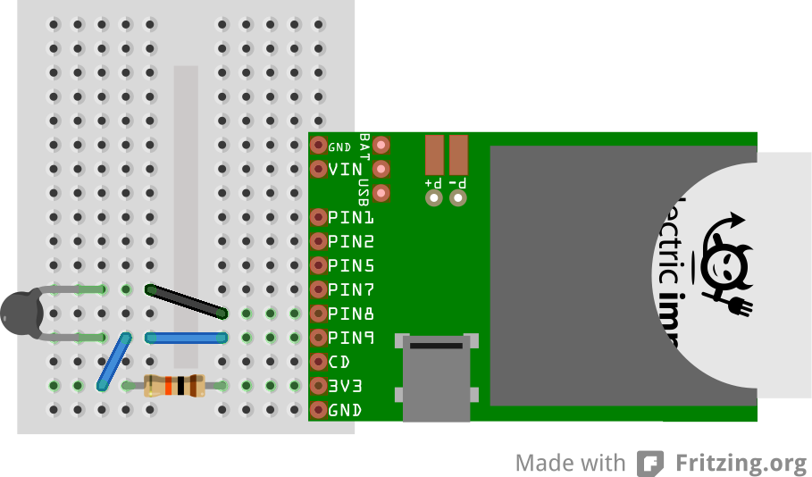

#Tempbug Battery Example
This example shows how to read a simple NTC thermistor and post the data to [Xively](https://xively.com/) every 15 minutes to be graphed. 

In this example, the resistive divider is between 3.3V and Imp Pin8, which is configured as an open-drain output. This allows the Imp to stop current from flowing through the divider by driving Pin8 high, which allows for very long operation on battery. 

##Hardware Configuration

Form a resistive divider from the 3.3V pin on the Electric Imp Breakout to Ground with a 100kΩ resistor and a 100kΩ NTC thermistor. The example code assumes the NTC thermistor is on the bottom half of the divider, connected between the analog input and Imp Pin8. Imp Pin9 should be connected to the middle of the divider.

For more information on building a battery-powered temperature sensor with Electric Imp and a Thermistor, see the [Tempbug Instructable.](http://www.instructables.com/id/TempBug-internet-connected-thermometer/).

##Software Operation
Unlike the simple example, this example does not reschedule readings with imp.wakeup. Instead, the Imp is programmed to take a single reading, then go to deep sleep with a timed wakeup. When the Imp wakes from deep sleep, the entire device firmware is reloaded and run from the beginning, so the loop is implicit. 
