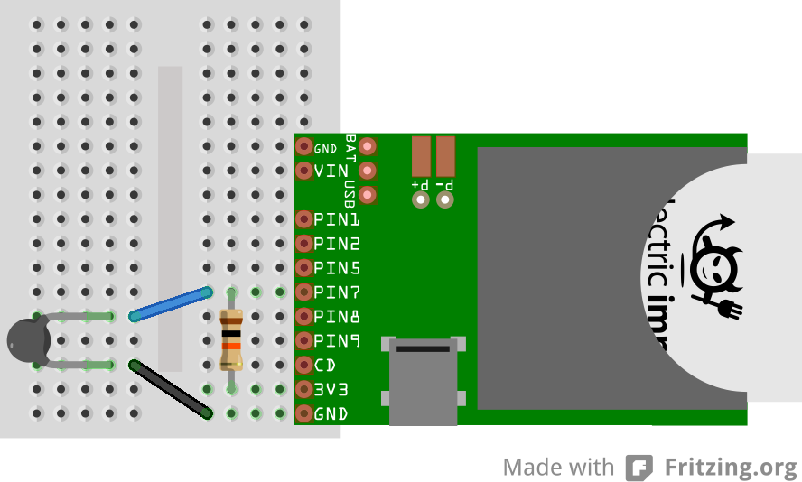

#Tempbug Simple Example
This example shows how to read a simple NTC thermistor and post the data to [Xively](https://xively.com/) every 15 minutes to be graphed. 

No consideration is made in this example for battery life. Please see tempbug-battery.

##Hardware Configuration

Form a resistive divider from the 3.3V pin on the Electric Imp Breakout to Ground with a 10kΩ resistor and a 10kΩ NTC thermistor. The example code assumes the NTC thermistor is on the bottom half of the divider, connected between the analog input and GND. Imp Pin7 should be connected to the middle of the divider.

